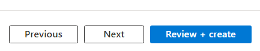

# Copy file
1. Create a copy of the `.env_template` as `.env` under the `earth_copilot `folder

# Create an Azure Maps Account resource

1. Click on Create a resource
1. Search for Maps
1. Click on the Azure Maps card

    
    
1. Click on Create

    
    
1. Provide a name and select a Resource Group

1. Click on Review + create

    
    
1. Finally click on Create

    
    
1. Once the service has deployed click on the Go to Resource button

    
    
1. Expand the Settings navigation and select Authentication

    
    
1. Copy the Primary key and paste in the .env file under the `earth_copilot `folder
