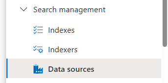

# Start by creating Blob Storage
1. Create a new Azure Storage 

    
    
1. Click on the Storage account card

    
    
1. Click on Create

    
    
1. Setup the following and click **Next**
    * Subscription
    * Resource Group
    * Storage account name
    * Region
    * Primary service: Set to Azure Blob Storage or Azure Data Lake Storage Gen 2
    * Performance: Standard
    * Redundancy: Locally-redundant stoage (LRS)

    
    
1. Make sure to check **Allow enabling anonymous access on individual containers**

    
    
1. Click **Review + create**

    
    
1. Finally click on **Create**

    
    
1. Click on the Got to resource button

    
    
1. Expand the Data storage section in the navigation and select Containers

    
    
1. Click on Add container

    
    
1. Set the Name to stac-data and **Anonymous access level** to `Container(anonymous read access for containers and blobs)` and click **Create**

    
    
1. Click on the newly created stac-data container

    
    
1. Depending on the scope you  can either choose the complete collection of smaller scope. These JSON files need to be uploaded to the stac-data container
    >Note: Make sure to make note of the json filename

    * Complete - https://openveda.cloud/api/stac/collections
    * Small scope - https://opsgilitylabs.blob.core.windows.net/nasa/openveda-minimum.json 
    
    
    
1. Click the Upload button after dragging the json file into the box

    
    

# Create an Azure AI Search
1. Click on Create a resource
1. Search for AI Search
1. Click on the Azure AI Search
    
    
    
1. Click on Create

    
1. Select a Resource Group and provide a Service Name

    
    
1. Click on Review + create

    
    
1. Finally click on Create

    
    
1. Once the service has deployed click on the Go to Resource button

    
    
1. In the selected Overview tab copy the Url link in the upper right-hand corner and past in the SEARCH_ENDPOINT section
    
1. Expand Settings in the navigation and select Keys

    
    
1. Copy the primary key and paste in the Search_Key section 

    
    
1. In the navigation expand Search management and select Indexes

    
    
1. From the **Add index** dropdown select **Add index(JSON)**

    
    
1. Paste in the following to establish the schema and click **Save**

    ```
        {
      "name": "stac-collections-index",
      "fields": [
        {
          "name": "collection_id",
          "type": "Edm.String",
          "key": true,
          "searchable": true,
          "filterable": true,
          "retrievable": true,
          "sortable": true,
          "facetable": true
        },
        {
          "name": "title",
          "type": "Edm.String",
          "searchable": true,
          "filterable": true,
          "retrievable": true,
          "sortable": true,
          "facetable": false,
          "analyzer": "standard.lucene"
        },
        {
          "name": "description",
          "type": "Edm.String",
          "searchable": true,
          "filterable": false,
          "retrievable": true,
          "sortable": false,
          "facetable": false,
          "analyzer": "standard.lucene"
        },
        {
          "name": "license",
          "type": "Edm.String",
          "searchable": false,
          "filterable": true,
          "retrievable": true,
          "sortable": true,
          "facetable": true
        },
        {
          "name": "spatial_bbox",
          "type": "Collection(Edm.Double)",
          "searchable": false,
          "filterable": true,
          "retrievable": true,
          "sortable": false,
          "facetable": false
        },
        {
          "name": "temporal_interval",
          "type": "Collection(Edm.String)",
          "searchable": false,
          "filterable": true,
          "retrievable": true,
          "sortable": false,
          "facetable": false
        },
        {
          "name": "providers",
          "type": "Edm.ComplexType",
          "fields": [
            {
              "name": "name",
              "type": "Edm.String",
              "searchable": true,
              "filterable": true,
              "retrievable": true,
              "facetable": true
            },
            {
              "name": "url",
              "type": "Edm.String",
              "searchable": false,
              "filterable": false,
              "retrievable": true,
              "facetable": false
            },
            {
              "name": "roles",
              "type": "Collection(Edm.String)",
              "searchable": true,
              "filterable": true,
              "retrievable": true,
              "facetable": true
            }
          ]
        },
        {
          "name": "thumbnail_url",
          "type": "Edm.String",
          "searchable": false,
          "filterable": false,
          "retrievable": true,
          "sortable": false,
          "facetable": false
        },
        {
          "name": "render_config",
          "type": "Edm.String",
          "searchable": false,
          "filterable": false,
          "retrievable": true,
          "sortable": false,
          "facetable": false
        },
        {
          "name": "datetime_range",
          "type": "Collection(Edm.String)",
          "searchable": false,
          "filterable": true,
          "retrievable": true,
          "sortable": false,
          "facetable": false
        },
        {
          "name": "time_density",
          "type": "Edm.String",
          "searchable": false,
          "filterable": true,
          "retrievable": true,
          "sortable": true,
          "facetable": true
        },
        {
          "name": "is_periodic",
          "type": "Edm.Boolean",
          "searchable": false,
          "filterable": true,
          "retrievable": true,
          "sortable": true,
          "facetable": true
        }
      ],
      "suggesters": [
        {
          "name": "sg-collections",
          "searchMode": "analyzingInfixMatching",
          "sourceFields": ["title", "description"]
        }
      ],
      "corsOptions": {
        "allowedOrigins": ["*"],
        "maxAgeInSeconds": 60
      }
    }
    ```
    
1. Then under Search Management click on **Data sources**

    
    
1. Click the **Add data source** dropdown and select the **Add data source**

    
    
1. By default you should be able to start with a Data Source os Azure Blob Storage. Select the Storage account you previously created

    
    
1. Select the Blob container previously created

    
    
1. Click Create

1. Click on the newly create Data source and the click the Edit JSON button

    
    
1. Modify the query value to the collection file name you uploaded (eg. openveda-minimum.json) then click **Save**

    
    
1. Now select Indexers from the navigation

    
1. Click on **Add indexer**


1. Configure the indexer with the following settings:
    * **Name**: `stac-collections-indexer`
    * **Data source**: Select the data source you created earlier
    * **Target index**: Select `stac-collections-index`
    * **Schedule**: You can set this to run once or on a schedule
    
1. Click on **Advanced options** and configure field mappings if needed:
    * Map JSON fields to your index schema fields
    * Ensure `collection_id` maps to the `id` field in your JSON
    * Configure any other field mappings as necessary
    
1. Click **Submit** to create the indexer

1. The indexer will start running automatically. You can monitor its progress in the Indexers section

1. Once the indexer completes successfully, go to **Search explorer** to test your index
    
1. In the Search explorer, you can test queries like:
    * `search=fire` (to find collections related to fire)
    * `search=California` (to find collections related to California)
    * Use filters and other search parameters to test functionality

1. Copy the **Search service name** and **Index name** for use in your Earth Copilot configuration

## Environment Configuration

After completing the Azure AI Search setup, make sure to update your environment variables:

```
SEARCH_ENDPOINT=https://your-search-service-name.search.windows.net
SEARCH_KEY=your-admin-key
SEARCH_INDEX=stac-collections-index
```

## Next Steps

Your Azure AI Search is now configured and ready to be used by Earth Copilot. The next step is to configure your Azure OpenAI service by following [03 AOAI.md](03%20AOAI.md).


