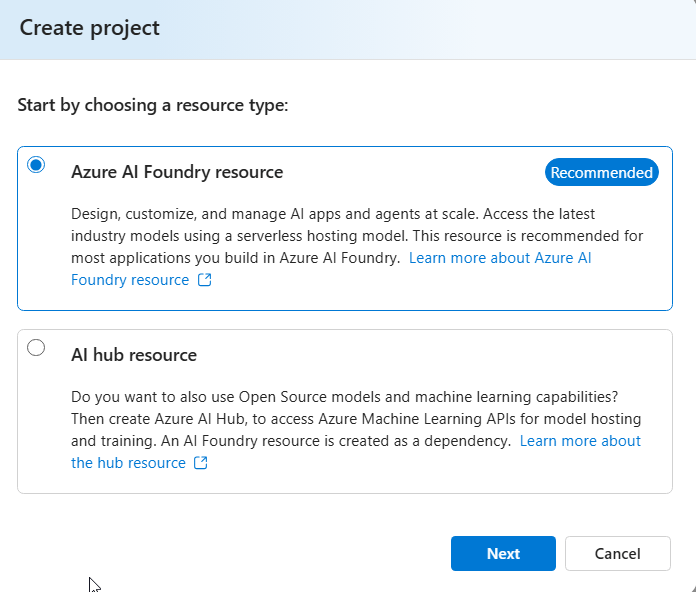
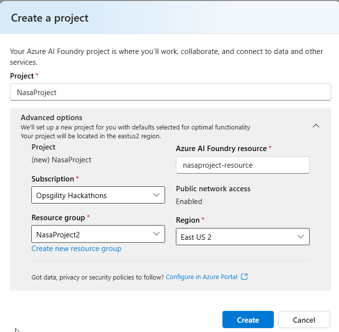
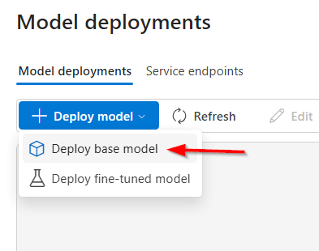
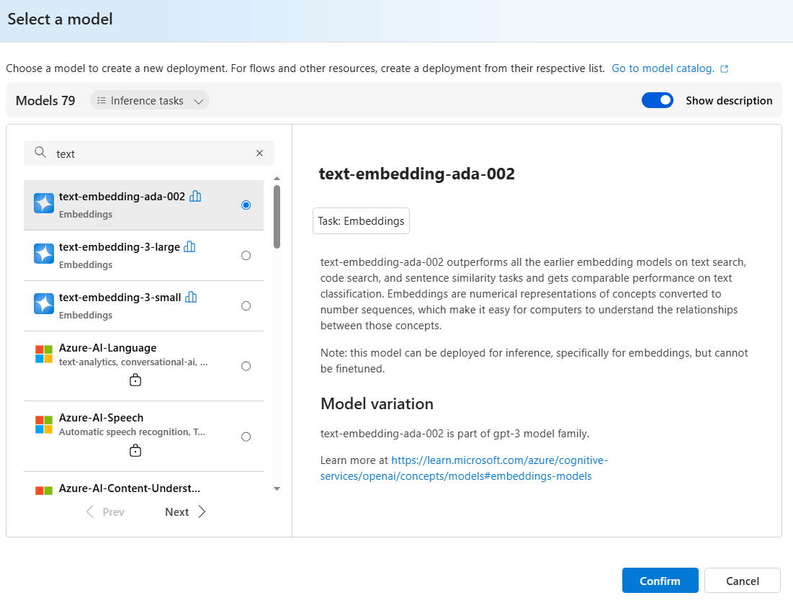

    
    
## Create an Azure AI Foundry Hub and Project
>Note: This guide is subject to changes in the UI
1. Visit https://ai.azure.com
1. Click on **Create new**
1. In the popup dialog select **Azure AI Foundry resource** and click **Next**

    
    
1. Provide the following and then click **Create**
    * Project Name
    * Subscription
    * Resource Group
    * Azure AI Foundry resource (automatically filled in)
    * Select a region (Normally very limited options)
    
    

1. After the deployment completes copy the API Key to the `.env `file and also switch the internal tabs to select **Azure OpenAI** and copy that endpoint for the `.env `file

1. In the left-hand navigation scroll down and click on Models + endpoints

1. Click on the **Deploy model** button and from the dropdown select **Deploy base model**

    
    
1. Search for `text` and select `text-embedding-ada-002` then click Confirm

    