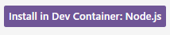
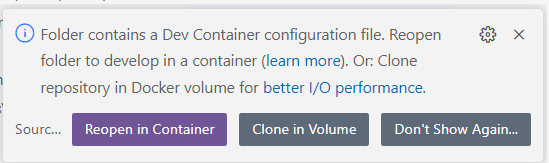
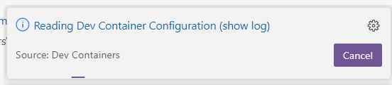
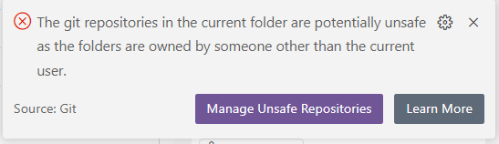
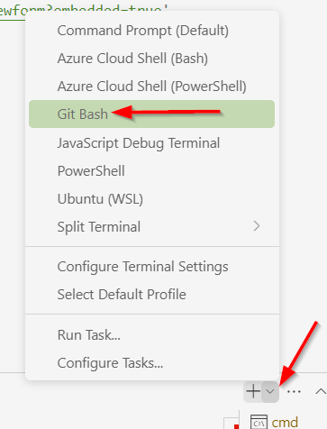
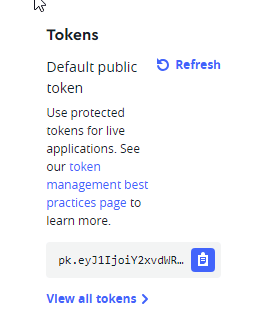
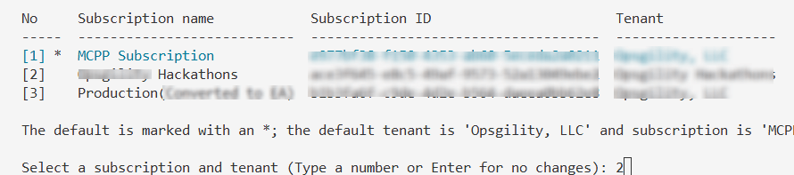
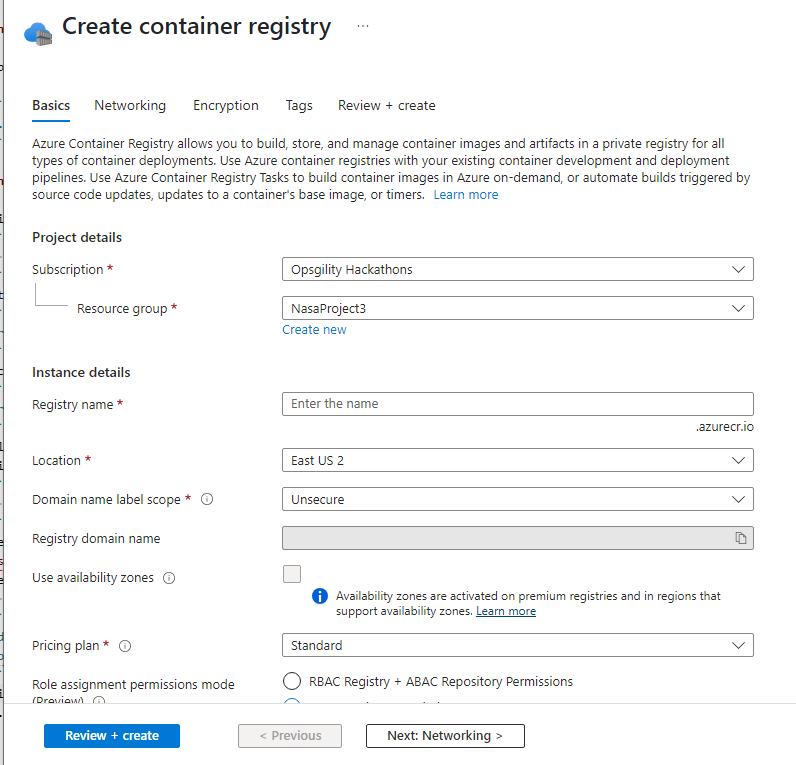
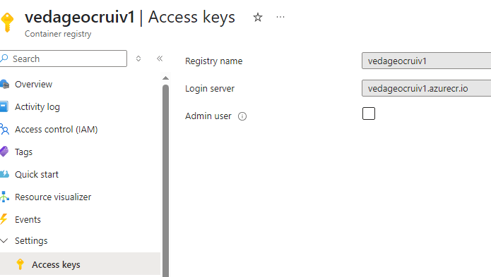
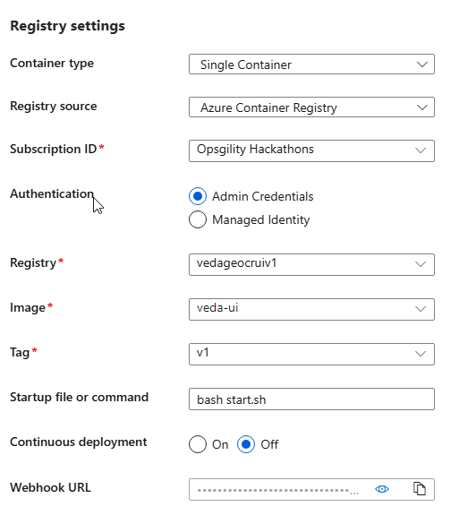

# Veda UI setup and configuration

## Setup
1. Some Extensions for VS Code may need to be enabled to work in a Dev Container. Click on Extensions in VS Code and click the button that says **Install in Dev Container: Node.js**. 
* Azure Extension
* Azure CLI tools

    

## Installation

1. Make sure Docker Desktop is still running

1. Open folder in VS Code
1. VS Code will give you a notification to open in a container. Click the **Reopen in Container**

    
    
1. Give it some time to open in a container

    
    
1. Just click close on the unsafe notification

    

1. Install Node + package manager this repo depends on.

    ```
    nvm install 
    
    npm -g install yarn
    ```

1. Then, setup the project by running the command below in VS Code after opening a Git Bash prompt and cd into the veda-geocopilot folder



1. Make sure you have a terminal open and type in the following one at a time (for a windows machine)
    ```
    cd .veda
    sed -i 's/\r$//' setup
    sed -i 's/\r$//' veda
    cd ..
    ```

## Usage
### Config files

Configuration is done using [dot.env](https://parceljs.org/features/node-emulation/#.env-files) files.

These files are used to simplify the configuration of the app and should not contain sensitive information.

Copy the `.env.local-sample` to `.env.local` to add your configuration variables.

    ```
    cp .env.local-sample .env.local
    ```
### Mapbox Token

Get your Mapbox access token from Mapbox Dashboard. Put the key in `.env.local` file.
1. Visit Mapbox https://account.mapbox.com/auth/signup/?page=/ to create an account. Requires email validation and adding your address

1. Copy the Token value from the upper right-hand corner

    
1. In Git Bash command I had to run the following
    ```
    yarn add dotenv
    yarn add --dev sass
    ```

## Running the app

1. To preview the app use:

    ```
    ./.veda/veda serve
    ```
    
## Using the Copilot branch

1. Navigate into the UI Subdirectory:
    ```
    cd .veda/ui
    ```
1. Install Dependencies with Yarn:
    ```
    yarn install
    ```
1. Execute the UI portion of the code
    ```
    yarn serve
    ```
## Deploy UI to the cloud
1. Login to Azure by typing in 
    ```
    az login
    ```
1. Select the correct subscription (if more than one)
    
1. Based off the name provided in the deployment script (below is a sample) create the `Container Registry` in Azure. In this example the name would be `vedageocrui`
    ```
    ./deploy.sh -i veda-ui:v1 -r vedageocrui.azurecr.io -n veda-ui -l eastus -g NasaProject3 -p /workspaces/veda-ui-feature-geocopilot
    ```
1. Visit https://portal.azure.com and create a `Container Registry` using the name used in the Deployment script in the **Registry name** and then select **Review + create**. Then click **Create**.
    
    
1. Then in the Container Registry make sure to enable Admin user. 
1. In the left pane, select Access Keys.
    

1. Set Admin user to Enabled.

1. Copy the username and password shown here to authenticate your ACR in the web app (if needed)
    
    
1. Run the deployment script
    ```
    ./deploy.sh -i veda-ui:v1 -r REGISTRYNAME.azurecr.io -n veda-ui -l REGION -g RESOURCE-GROUP -p /workspaces/veda-ui-feature-geocopilot
    ```
1. After deployment go to the **App Service** deployed in Azure and Go to **Deployment -> Deployment Center** and verify there are no errors

    
    
1. 
