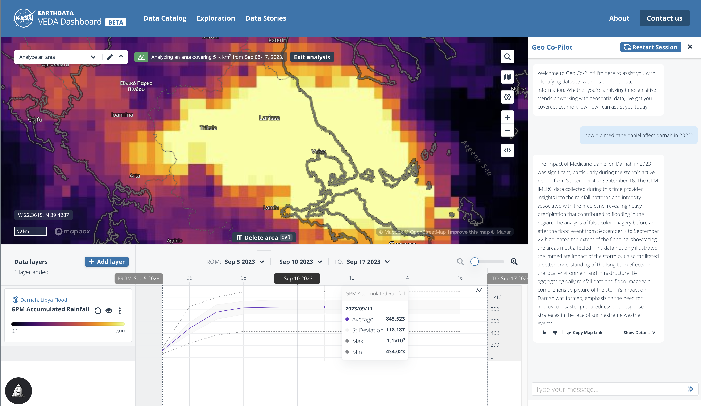
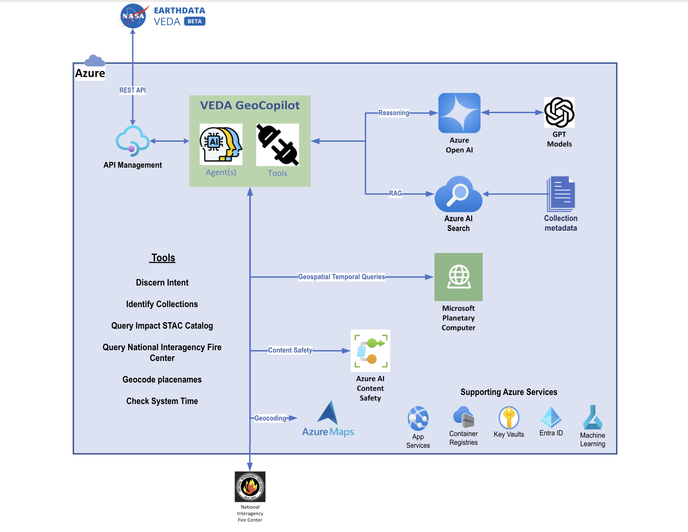
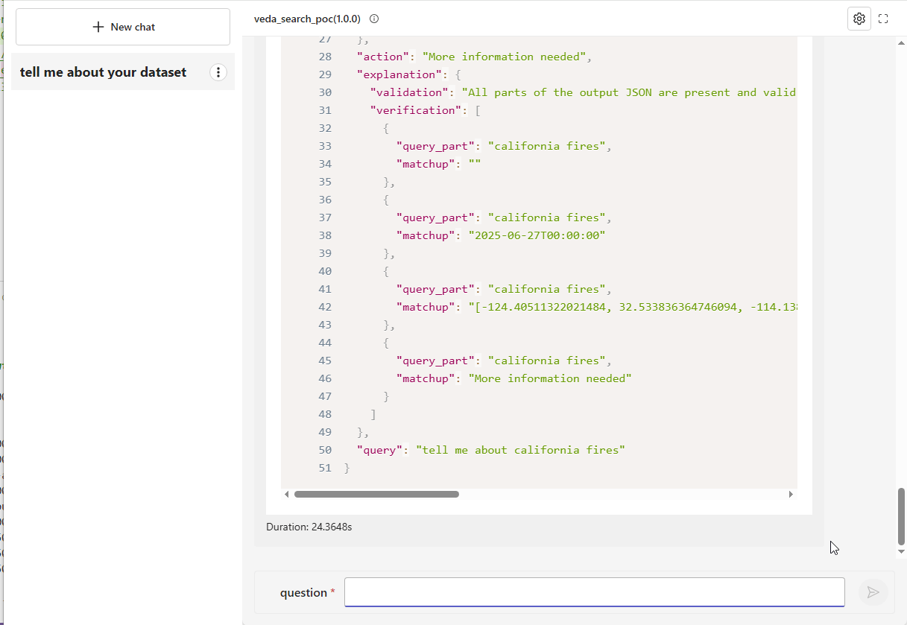
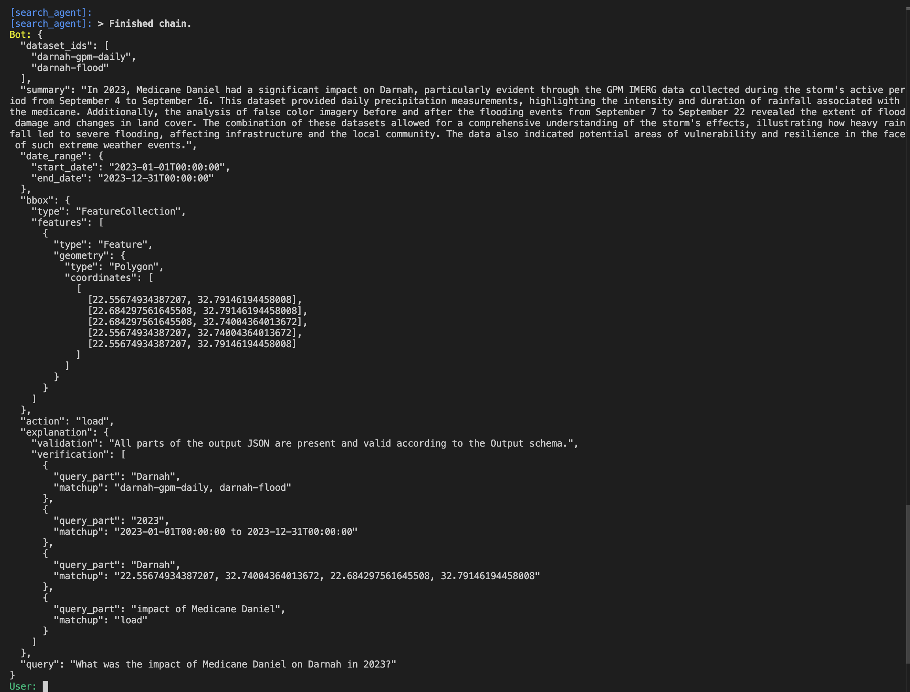
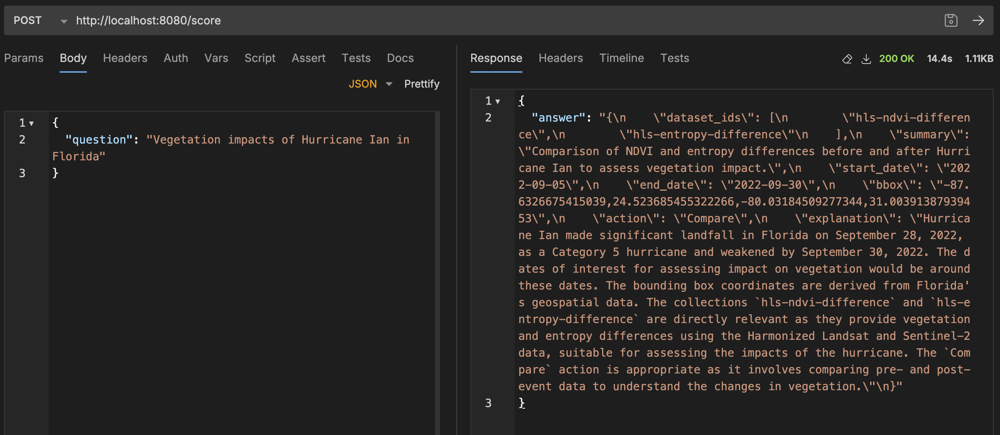

# Build your own Earth Copilot in Azure to interact with your Geospatial Data 

Use this article to learn how to build your own Earth Copilot using Microsoft Azure AI services.  This Earth Copilot will allow you to interact with geospatial data using natural language questions, exploring metadata and previewing results, generate STAC API queries without writing a single line of code, and integrate Earth Copilot into your won research workflows in Azure.  

## What is Earth Copilot?
NASA and Microsoft teamed up to prototype NASA Earth Copilot, an AI-powered assistant that makes it easier than ever to search, explore, and understand NASA’s vast Earth science data using plain language.

Whether you're a scientist, analyst, or student, Earth Copilot helps you spend less time finding the right data—and more time unlocking insights.

🎥 Watch Satya Nadella introduce NASA Earth Copilot at Microsoft Ignite 2024 https://www.linkedin.com/posts/microsoft_msignite-activity-7265061510635241472-CAYx/?utm_source=share&utm_medium=member_desktop

The following screenshot show the Earth Copilot in action, operating out of the NASA VEDA User Interface.  The Earth Copilot user interactions are in the right pane, with visualizations of the data retrived on the left.



## Architecture Overview

The Earth Copilot follows an architecture with a specialized ReAct-style agent and a set of tools at their core. The agent is the operationalized with the Azure platform for security, scalability, resiliency and observability.



The architecture is powered by the following Azure services:

- Azure OpenAI Service: Hosts and provides access to LLM models used for AI tasks, integrated via Prompt Flow and environment variables.
- 	Azure Container Registry: Stores Docker container images for the Earth Copilot applications before deployment to App Service.
- Azure App Service: Runs the deployed web applications and manages their scaling and availability.
- Azure AI Search: Stores and enables search over geospatial collections metadata for retrieval-augmented generation (RAG) and similarity search features.
- Azure AI Content Safety: Detects and blocks harmful content (violence, hate, sexual, self-harm) in user input or generated text.
- Azure Maps: Provides geocoding and location-based search capabilities via its API and subscription key for mapping tools.
-	Azure Identity: Used for authentication and identity management in scripts and runtime, enabling secure service connections.

---

## 1. Prerequisites
- Basic knowledge of Python and command-line usage
- Access to VEDA collection metadata or your own STAC metadata via Microsoft Planetary Computer-Pro (https://learn.microsoft.com/en-us/azure/planetary-computer/)
- An Azure Subscription (for deploying required services)
- Access to Earth Copilot GitHub repository (git clone https://github.com/jclopezspace/earth-copilot.git)

---

## 1a. Provision Required Azure Services
You will need to create and configure the following Azure resources:

### 1. Azure Maps
- In the Azure Portal, search for "Azure Maps" and create a new resource.
- After creation, go to "Authentication" and copy your Primary Key.

**📖 For detailed setup instructions:** [01 Create Map.md](01%20Create%20Map.md)

### 2. Azure AI Search
- In the Azure Portal, search for "Azure AI Search" and create a new resource.
- Create an index for your Earth science metadata (VEDA or STAC collections).
- Note your Search endpoint, API key, and index name.

**📖 For detailed setup instructions:** [02 Create AI Search.md](02%20Create%20AI%20Search.md)

### 3. Azure OpenAI Service
- Go to the [Azure Portal](https://portal.azure.com/).
- Search for "Azure OpenAI" and create a new resource.
- Deploy a model (e.g., `gpt-4o-mini`).
- After deployment, note your endpoint and API key.

**📖 For detailed setup instructions:** [03 AOAI.md](03%20AOAI.md)

### 4. Azure Blob Storage
- If you want to store or serve large metadata files, create a Blob Storage account.

### 5. Environment Variables & Config Files
- Add your keys and endpoints to `azure_openai.yaml`, `openai.yaml`, or as environment variables.
- Example keys to set:
  - `AOAI_KEY`, `AOAI_ENDPOINT`, `AOAI_DEPLOYMENT`, `AOAI_VERSION`
  - `SEARCH_KEY`, `SEARCH_ENDPOINT`, `SEARCH_INDEX`
  - `AZURE_MAPS_SUBSCRIPTION_KEY`
  - (Optional) `EARTH_COPILOT_CATALOG_URL` for custom STAC metadata

Refer to the sample config files in `earth_copilot/` for structure.
---

## 2. Clone the Repository
You can start by cloning this repository or copying the code structure into your own project folder.

```bash
git clone https://github.com/jclopezspace/earth-copilot.git
```
---

## 3. Install Dependencies
Navigate to the `earth_copilot` directory and install the required packages:

```bash
cd earth_copilot
pip install -r requirements.txt
```

This will install all required dependencies, including those needed for the agent tools and Azure integration. If you encounter missing package errors, ensure your Python environment is activated and up to date.

---

## 4. System Prompt Customization

The system prompt is the core instruction set for the AI agent. You can access and modify it in `earth_copilot_poc/prompt_templates.py`.

### How to Access the System Prompt
1. Open `earth_copilot/prompt_templates.py` in your code editor.
2. Look for the `system_prompt` or `SYSTEM_PROMPT` variable inside the `get_search_agent_JSON_output()` function or at the top of the file.
3. The prompt is a long string that describes how the agent should behave, what steps it should take, and how it should format its output.

### How to Modify the System Prompt
You can edit the text of the system prompt to:
- Change the agent's tone (e.g., more conversational, more technical)
- Add or remove instructions (e.g., require more detailed summaries, change how collections are selected)
- Adjust output formatting or required fields

#### Example 1: Make the Agent More Conversational
Change:
```
Your tone should be precise and scientific, and avoid using hyperbolic adjectives such as 'significant', 'critical', 'crucial', etc.
```
To:
```
Your tone should be friendly and conversational, making the information accessible to non-experts.
```

#### Example 2: Require More Detailed Summaries
Add a line such as:
```
In the summary, always include at least three key findings and suggest a next step for the user.
```

#### Example 3: Change Output Schema
If you want to add a new field to the output JSON, update the `format_instructions` and the prompt to describe the new field and how it should be filled.

**Tip:** After making changes, save the file and restart your agent to apply the new prompt behavior.

---

## 5. Grounding with Metadata

Earth Copilot can be grounded using either:
- The provided VEDA collection metadata (default)
- Your own STAC metadata (custom)
- Metadata from Microsoft Planetary Computer-Pro (recommended for global, up-to-date Earth science data)

### What is STAC?
STAC (SpatioTemporal Asset Catalog) is an open specification for describing geospatial data in a standardized, machine-readable way. STAC makes it easy to search, discover, and use satellite imagery and other geospatial assets across different platforms and providers.

Learn more: [STAC Overview on Microsoft Learn](https://learn.microsoft.com/en-us/azure/planetary-computer/stac-overview)

### Using VEDA Collection Metadata
By default, the agent loads VEDA collection metadata:

1. **Latest NASA VEDA collections** were accessed from the official VEDA STAC API: https://openveda.cloud/api/stac/collections
2. **Downloaded and saved** as `open_veda_collections.json` in the `utils/` folder for local processing
3. **Processed and minimized** using `utils/minimize_collection_metadata.py` to remove unnecessary fields while preserving essential spatial and temporal extent information
4. **Indexed** into Azure AI Search for fast similarity search and retrieval

The `utils/` folder contains:
- `open_veda_collections.json` - The complete NASA VEDA collections metadata
- `open_veda_collections_minimized_with_extents.json` - Processed version with reduced size
- `minimize_collection_metadata.py` - Script to process and minimize the metadata
- `output_schema.json` - JSON schema for the agent's output format

### Using Your Own STAC Metadata
To use your own STAC metadata (including from Microsoft Planetary Computer-Pro):
1. Export or download your STAC metadata file (JSON). For global, up-to-date datasets, consider using the [Planetary Computer-Pro STAC API](https://planetarycomputer.microsoft.com/).
2. Place your STAC metadata file in the `utils/` directory.
3. Update the metadata loading logic in `utils/load_search_index.py` to point to your file.

Example:
```python
# In earth_copilot/utils/load_search_index.py
METADATA_PATH = "utils/your_stac_metadata.json"
```

**Tip:** The [Microsoft Planetary Computer](https://planetarycomputer.microsoft.com/) provides a vast catalog of STAC-compliant datasets that can be used to ground your Earth Copilot for a wide range of geospatial applications.

---

## 6. Running the Agent
Promptflow CLI provides a way to start an interactive chat session for chat flow. You can use below command to start an interactive chat session: 

```bash
# Test VEDA Search POC
cd earth_copilot
pf flow test --flow . --interactive
```

After executing this command, you can interact with the chat flow in the terminal. Press Enter to send the message to chat flow. Quit with ctrl+C.


The Earth Copilot also takes the form of a web API, allowing for integration into any number of applications, including the VEDA UI. To this end, Prompt Flow allows you to run the Earth Copilot flow as a web API locally by running the following:

```bash
# Test as web API
pf flow serve --source ./earth_copilot --port 8080 --host localhost

```
In the query type in `tell me about California fires`
>Note: The current codebase uses Prompt Flow and will require connections to be setup. So the first few times you execute this you will see errors requesting connections to be setup. The following is an example of what the command to use to populate the connection. Please see the Potential Issues file for assistance.



Here are a few other examples of outputs in different modalities, including a web UI, and the second is an API testing tool:




Once you've started up the Earth Copilot web API, you can navigate to this address to obtain its Open API documentation, in JSON format:

http://localhost:8080/swagger.json

## 6. Deploying to Azure
First, create an Azure Container Registry.  This will host the Earth Copilot, which will be built as a Docker container.  Make sure that Docker Desktop is running.

This will package the distribution and create a Dockerfile that our deployment script will reference:

```bash
# Build Docker container
pf flow build --source ./earth_copilot --output dist --format docker

# Deploy using the provided script at the root level 
> Note: If you are on a Mac or Linux device you can run this directly. On Windows it needs Github Bash
./deploy.sh -i earth_copilot:v1 -r vedageocr.azurecr.io -n veda-search-deployment -l eastus -g < Resource-Group-Name -p dist
```

---

## 7. Customization Tips
- **System Prompt:** Edit `prompt_templates.py`.
- **Metadata:** Swap or edit files in `utils/` and replace file in your AI Search step for RAG.
- **Agent Logic:** Modify `search_agent.py` and tools in `tools/` as needed.
- **Dependencies:** If you add new tools or features, update `requirements.txt` accordingly.

---

## 8. Example Usage
Ask questions like:
- "What satellite data is available for California in July 2023?"
- "List all collections with wildfire data."

---

## 9. Troubleshooting
- Ensure your API keys are set up in `azure_openai.yaml` or `openai.yaml`.
- Check dependencies in `requirements.txt`.

---

## 10. Next Steps
- Integrate with your own data sources.
- Extend the agent with new tools.
- Share your improvements!

---

## File Structure
```
earth_copilot/
    azure_openai.yaml
    openai.yaml
    requirements.txt
    prompt_templates.py
    search_agent.py
    tools/
        ...
    utils/
        load_search_index.py
        minimize_collection_metadata.py
        output_schema.json
```

---

## Credits
Adapted from the VEDA_Search_POC developed by NASA IMPACT and Microsoft. This POC is designed to showcase the capabilities of Earth Copilot in handling Earth science data.